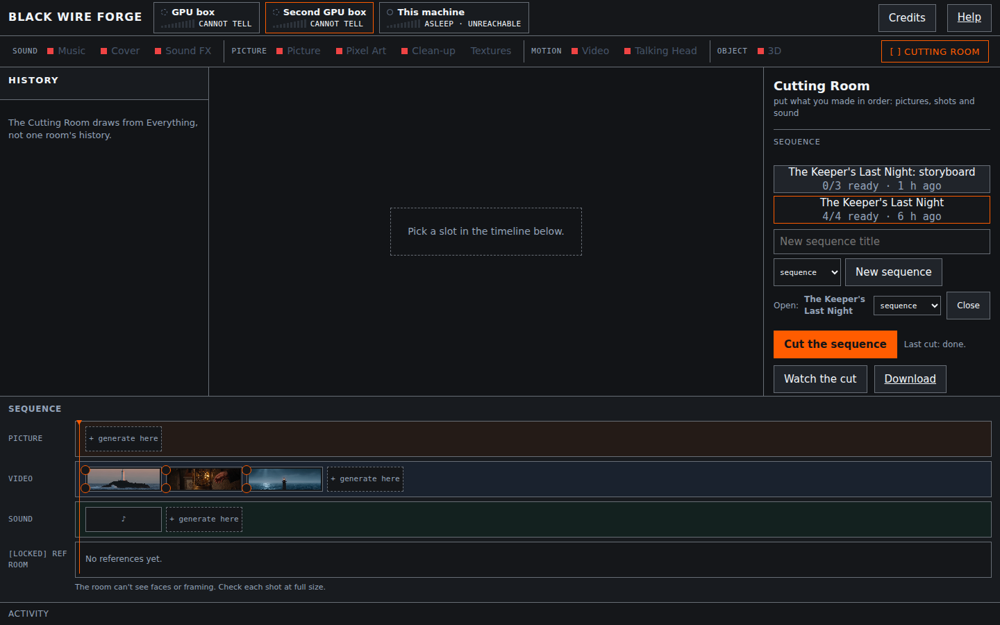
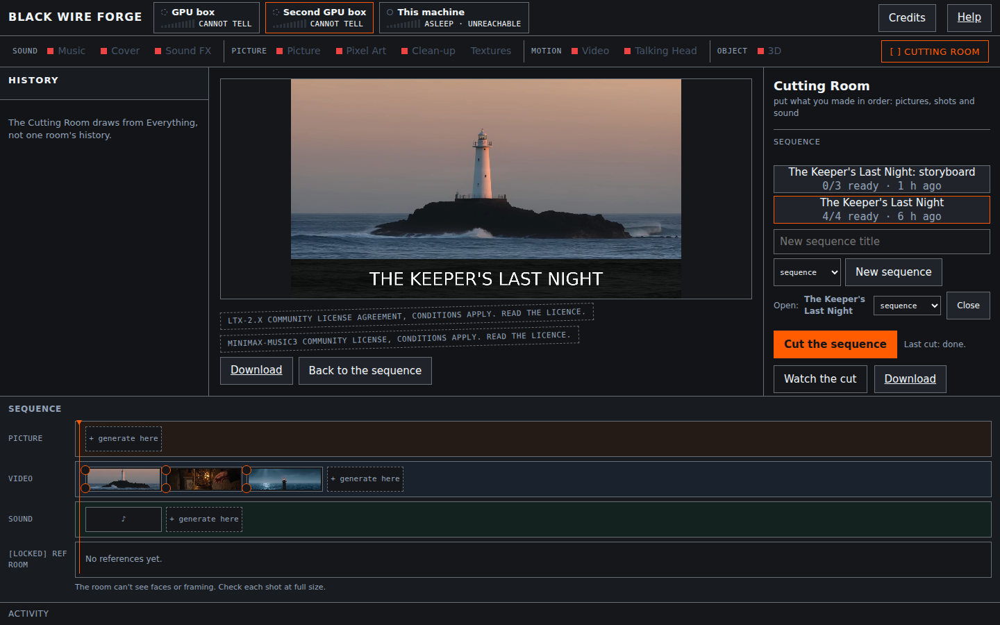
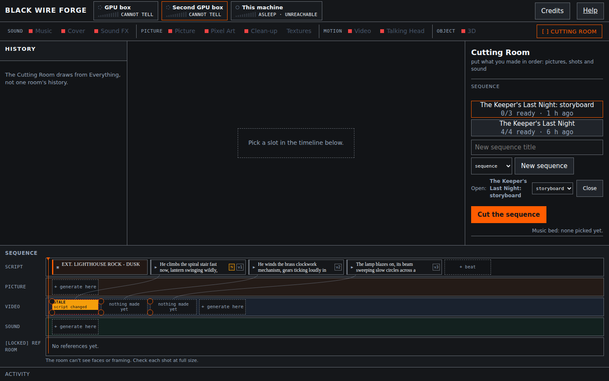

# Black Wire Forge

A plain-language web interface for one or more ComfyUI instances. Say what you want, choose an
available machine, and the app builds and submits the graph; sequence and process-lane workflows
can select an eligible machine automatically. **Black Wire Studios.**

Forked from [2Wild-Image-Video-Gen-Studio](https://github.com/tonyd2wild/2Wild-Image-Video-Gen-Studio)
(MIT).

## Who this is for

For people who already run ComfyUI on a GPU machine (or are about to set one up) and want a
plain-language front end for it. New to ComfyUI, or setting this up for someone else? Hand
this repo to an agentic coding assistant (Claude Code, Codex, Hermes Agent, ...) and have it
follow [`AGENTS.md`](AGENTS.md) — it walks through deciding whether you need ComfyUI at all,
installing, and verifying each piece is actually working.

    test -e config.json || cp config.example.json config.json   # then put your own hosts in it
    python3 server.py                                            # http://127.0.0.1:3998

Runs in the foreground; leave it running and use a second terminal for anything else.
`requirements.txt` is optional (see "Install" below) and, on modern distro Python, needs its
own virtual environment rather than a global `pip install` — same command either way.

`config.json` is gitignored: it carries machine addresses and never belongs in the repo. The
`test -e ... ||` guard above only creates it if it doesn't already exist, so re-running this
never clobbers a real one.

## What it looks like

<p float="left">
  
  
  
</p>

Video frames in these screenshots were generated with LTX-2.5 (Lightricks), used under the
[LTX-2.x Community License](https://github.com/Lightricks/LTX-2/blob/main/LICENSE-2_x); they
are machine-generated.

The app has no login. It checks that requests arrive through its own address (`localhost`,
the machine's own IP and hostname work with no configuration; any other name you reach it
by — a mDNS name, a reverse proxy — goes in `"allowed_hosts"`, e.g. `["forge.lan"]`) and
applies some defense in depth against cross-site browser requests. This is not
authentication and does not make the app safe to expose beyond a trusted LAN — see
`SECURITY.md` for exactly what the guard does and does not check.

## Install

The app runs with nothing beyond the Python standard library. `requirements.txt` (numpy,
Pillow) is optional: without it the server still starts and answers every request, and the
two things that need them -- Pixel Art's colour-lock/dither step, and the picture->video
image-fit step -- report themselves unavailable with a plain sentence saying what to install,
instead of crashing the server. `ffmpeg` is likewise optional: without it the Cutting Room's
cut still opens, it just cannot build one yet (see the Cutting Room's own note in `/help`).
Install both in a virtual environment -- modern distro Python refuses a bare, global
`pip install` (PEP 668's "externally managed environment"; confirmed failing on a stock
Ubuntu 26.04/Python 3.14 box):

    python3 -m venv .venv
    .venv/bin/python -m pip install -r requirements.txt
    .venv/bin/python server.py

## Minimal config

`config.json` is required and its `"lanes"` list must not be empty -- the app ships no
machine addresses of its own and refuses to start without at least one. The smallest working
config, one ComfyUI instance running on the same machine:

```json
{
  "port": 3998,
  "bind": "127.0.0.1",
  "lanes": [
    {"id": "local", "name": "This machine", "host": "127.0.0.1", "port": 8188, "caps": ["image"]}
  ]
}
```

- **lane**: one ComfyUI instance the app can send a job to. Each needs an `id` (unique),
  `name` (shown in the UI), `host`/`port` (where its own ComfyUI API answers). `caps` --
  which kinds of job it's for (`"image"`, `"video"`, `"audio"`, `"3d"`) -- is *optional* for
  a ComfyUI lane: leave it out and the lane is considered for every capability, and
  discovery decides what it can actually run from the model files it finds. Set `caps` to
  a non-empty subset to restrict the lane's purpose on purpose. A **process** lane (a local
  program instead of ComfyUI, see below) must declare `caps` -- nothing about it is
  discoverable until its programs are.
- **port** / **bind**: where this app itself listens. The example above binds only to
  `127.0.0.1` (localhost); change `bind` to `"0.0.0.0"` only when you intentionally want
  this reachable from other machines on your LAN -- the app has no authentication or TLS,
  so anyone who can reach it can see every job and start new ones (see `SECURITY.md`).
- **allowed_hosts**: extra hostnames the app will answer besides `localhost` and its own
  IP/hostname (see above).

`config.example.json` ships exactly this one-lane localhost example. See "Advanced
configuration" below for multi-lane, multi-GPU, process-lane, status-tile and helper setups.

## Prerequisites for your first render

Black Wire Forge does not install ComfyUI, custom nodes, or model weights -- it only talks
to a ComfyUI instance you already have running. Start the app and open a room; a lane
missing something says so with a "needs ..." sentence rather than failing silently.

For the Picture room (Qwen-Image 2.1, `engines/qwen_image.py`), your lane's ComfyUI needs:

- **Node types**: `UNETLoader`, `CLIPLoader`, `VAELoader`, `TextEncodeQwenImage21`, `APG`,
  `FreSca`, `KSampler`, `VAEDecode`, `SaveImage` -- these are all core in current ComfyUI,
  nothing extra to add. The recommended GGUF-quantised UNet additionally needs `UnetLoaderGGUF`
  from the ComfyUI-GGUF custom node pack (see `docs/MODELS.md`'s "Custom-node packages").
- **Model files**: a UNet, a CLIP/text-encoder, and a VAE whose filenames discovery
  recognizes as `qwen_image`-named (see "Qwen-Image 2.1 preference" below).

Other rooms (Video, Music, 3D, ...) need their own engine's nodes and models the same way;
read the relevant file under `engines/` for the exact roles it declares.

## GPU and no-GPU paths

Most generation modes require a suitably configured ComfyUI GPU lane. A GPU-free path is
available for one thing: turning an existing `.glb` file into an orbiting turntable video,
using Blender (rendered on the CPU, `engines/turntable.py`) and `ffmpeg`, configured as a
`"kind": "process"` lane (see "Advanced configuration" below). No cloud-backed generation
lane is included.

## Advanced configuration

Everything below is optional; the minimal config above is a complete, working setup on its
own.

- **Multiple lanes / multi-GPU**: add more entries to `"lanes"`. `gpu`/`gpu_label` name the
  physical card a lane sits on (defaults to the lane's `host`); two lanes sharing a `gpu` key
  are treated as unable to hold weights at the same time, and the app frees one before
  dispatching to the other. A lane may also carry `"shared": "..."` as a plain note that
  something else also uses it.
- **Process lane**: `{"id": ..., "name": ..., "kind": "process", "caps": ["3d"]}` -- runs a
  local program instead of ComfyUI (no `host`/`port`). The included turntable pack needs
  Blender and `ffmpeg` on `PATH`.
- **Status-only tile**: `"status_only": {"name": ..., "host": ..., "port": ..., "path":
  "/v1/models", "gpu_label": ...}` -- a read-only strip tile (e.g. an LLM server), never
  dispatched to. Omit it and the tile does not appear.
- **helper**: `{"url": "http://host:port/v1", "model": "...", "timeout_s": 60}` -- an
  optional OpenAI-compatible chat endpoint for "Help me write this" / "Describe this
  picture". Omit it entirely to hide those buttons. If configured, your text (and, for
  "Describe this picture", the image) is sent to that endpoint -- see `SECURITY.md`.

  The same helper also powers each room's **guide**: a persona (the Sound, Picture, Motion and
  Object guides in their rooms, the Film Room Guide in the Cutting Room) that talks the idea
  through with you inside the room, from the files in `guides/`. Each turn tells the guide the
  room's selected mode and main field values, and that no picture is attached (the chat is
  text-only), so it never has to take your word for either. A **Compact / Verbose** toggle picks how much the guide knows; Compact is the
  default and suits small models, and if the helper reports a context too small for your
  choice the panel says so but never switches it for you. A reply cut short by its length
  limit is flagged, never silently trimmed. The conversation stays in your browser (per
  sequence in the Cutting Room) and is sent with each turn. With no `helper` configured the
  panel still shows the guide's plain guidance and how to add a helper. Guide chat waits up
  to `timeout_s` (120 seconds when unset), since a verbose guide is slow on a small box. The
  panel states how much context each choice needs (the guide plus 4,096 tokens for the
  conversation). The app reads the helper's context from llama.cpp's `/props`, else from
  `/models`, which on llama.cpp reports the model's TRAINING context rather than what the
  server was started with; set `"context": 16384` (a whole number of tokens) in `helper` to
  state it yourself, and that wins.
- **cut.fontfile**: `{"cut": {"fontfile": "/path/to/a/TrueType/font.ttf"}}` -- the font the
  cut's title cards use. Without it the app looks for a handful of common DejaVu/Liberation
  paths. A cut with no title cards still works either way; a cut that DOES include one is
  refused with a plain configuration sentence until a font is available, one way or the other.
- **timing**: `{"timing": {"poll_seconds": 4.0, "job_poll_seconds": 3.0, "http_timeout": 8.0,
  "free_settle_seconds": 2.0, "discover_seconds": 300.0}}` -- lane-status poll interval,
  active-job history poll interval, per-request HTTP timeout, how long to let a driver
  settle after freeing VRAM, and how often to re-read a lane's model list. Shown values are
  the built-in defaults; only set a key to change it.

## What is ours, and why

| change | why |
|---|---|
| Pillow replaces macOS `sips` | upstream's image-fit path could not run on Linux at all |
| Qwen-Image **2.1** graph schema | the graph is built for the 2.1 node contract (`TextEncodeQwenImage21`); it is not built to also speak the 2.0 schema |
| discovery finds **GGUF** unets | one lane holds 2.1 only as GGUF, invisible to `UNETLoader` |
| downloads are **sanitized** | a ComfyUI PNG can embed model filenames and your full prompt |

**Qwen-Image 2.1 preference, not enforcement.** Discovery's role rule for the image UNet/VAE
*prefers* filenames containing `2.1` but matches any file whose name contains `qwen_image`;
it does not require `2.1` in the name. If a lane holds another `qwen_image`-named file,
discovery may select that one, and the 2.1-specific graph will be built against it. Verify or
override the selected model filenames (`"models"` in `config.json`) if you need to be certain
which file is used.

## Reading order

- `docs/ARCHITECTURE.md` — lanes, discovery, packs, rooms, jobs, sequences and the cut
- `docs/WRITING-A-PACK.md` — how to add an engine

## Testing

`scripts/run-tests.sh` runs `tests/test_*.py` one suite at a time, each with `TMPDIR` pointed at
a scratch directory on disk instead of the box's default `/tmp` — on some Linux setups `/tmp` is a
RAM-backed tmpfs, and a killed or timed-out suite otherwise leaves its media there. The scratch dir
is deleted after every suite regardless of outcome. Pass suite paths as args to run a subset,
`SKIP="test_storyboard*"` to skip by glob, `TIMEOUT=<secs>` (default 900) per suite, and
`SCRATCH_ROOT=` to change where scratch lands (default `~/.cache/bwf-tests`). GNU `timeout` enforces that
per-suite limit; without it (stock macOS has none) the runner falls back to `gtimeout`, else
runs with no time limit at all and prints one note saying so, rather than failing outright.
No `config.json` is required to run
the suite: every test either spins up its own scratch config (`tests/_scratch_config.py`, for the
ones that `exec_module` `server.py` directly) or never imports `server.py` as a running app at
all -- none of them read the one next to `server.py`.

The full suite needs, beyond the Python standard library: `requirements.txt` (numpy, Pillow),
`requirements-dev.txt` (playwright) plus `python3 -m playwright install --with-deps chromium`, and
`ffmpeg`/`ffprobe` on `PATH`. Without any of these, the suites that need them print a plain `SKIP`
reason and exit cleanly rather than failing -- a clean clone with none of the optional deps
installed still passes the suites that do not need them.

## Licences

This application (the web UI and the Python server in this repository) is MIT, upstream's —
see `LICENSE`.

Black Wire Forge ships **no model weights**. Each engine pack under `engines/` drives a model
the user downloads themselves, under that model's own licence — this repo neither holds nor
relicenses those terms. See **[`docs/MODELS.md`](docs/MODELS.md)** for every built-in engine's
model source, size, and licence (including the non-commercial and territory gates) before
downloading anything.

Every finished job carries a licence stamp for the engine that made it; the Credits panel in
the app repeats that same information live from the installed engines. These are informational
badges, not a legal clearance — review the model licence and the rights in your prompts,
references, and output before publishing anything made here.
