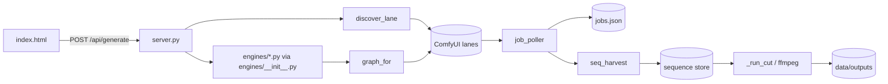
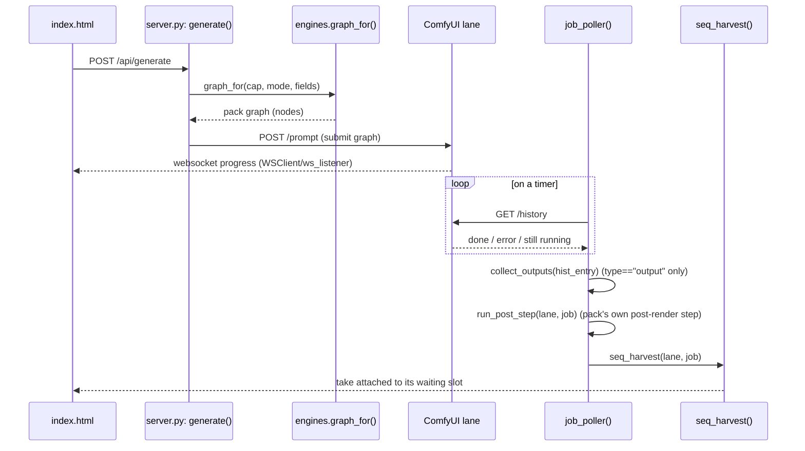
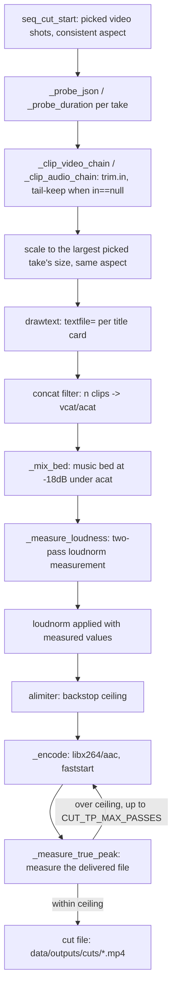

# Architecture

One page. For the pack contract (how to add an engine) see `docs/WRITING-A-PACK.md`.

## Lanes

A **lane** is one render backend the app can send a job to — almost always a ComfyUI
instance (`host`/`port` in `config.json`), reached over its HTTP API and a websocket for
live progress. A second kind of lane, the **process lane**, runs a local program instead
(`runner.py`) — used today for the Blender turntable pack, which renders on the CPU and
needs no ComfyUI at all. The core dispatches to either kind through the same job/poller
machinery; `engines.lane_kind(cap, mode)` is the only place that asks which one a mode needs.

## Discovery

Each lane is polled on a timer (`discover_lane`). The app asks the lane's `/object_info`
for every model **pool** it cares about (checkpoints, UNets, VAEs, CLIPs, LoRAs, ...),
then resolves each engine pack's declared **roles** against what's actually on disk —
matching by rule (`pick_model()`'s case-insensitive `all`/`none`/`any` substring gates on
the filename, plus `prefer` ranking among the survivors) rather than a hardcoded model
list. `abilities(lane)` folds the resolved roles into per-mode booleans through
`engines.abilities()`; `missing_for(lane, mode)` turns an unresolved role into a plain
sentence ("the LTX video model is missing"). A lane's `caps` in `config.json` say what
it's *for*; discovery says what it can *actually* do right now — the UI offers the
intersection.

## Packs

`engines/` holds one module per model family (Qwen-Image, LTX, MiniMax-H3, the audio
engines, cleanup/upscale tools, pixel art, the 3D pack, the Blender turntable). Each
module exports a single `ENGINE` dict — id, capability, roles, graph builders, form
fields, presets, quality tiers, examples, licence. `engines/__init__.py` is the seam: the
core (`server.py`) never imports a pack directly or names a model; it calls the loader's
functions (`graph_for`, `fields`, `abilities`, ...) and the loader answers from whichever
packs are installed. Adding a model family means adding a file under `engines/`, not
editing the core.

## Rooms

`rooms.json` groups modes into task-shaped rooms (Music, Picture, Video, 3D, ...) using
plain task words, never a model or engine name. `engines.rooms()` merges that file with
whatever modes the installed packs actually declare, so a pack with no room entry still
gets a room built from its own label — the page always has somewhere to show a working
engine, and a room with nothing installed for it still shows up, dimmed.

## Guides

A room in `rooms.json` may name a **guide** (`"guide": "film"`): the persona the optional
`helper` speaks as in that room. Each lives in `guides/<id>/`, and `guides.py` loads every
named guide once at startup; a named guide that is missing or broken refuses startup with
one sentence naming the file. `guide.json` carries `id`, `name`, `persona` (the persona
JSON, whose `definition` the panel shows), `projections` (`compact` and `verbose` system
prompts), `knowledge`, `caps` (per projection: `max_tokens` sent to the helper, and
`answer_chars`, past which a reply is cut at a sentence end and flagged), `greeting`, and
`no_brain` (the plain lines shown when no helper is configured). `GET /api/guide?room=<id>`
returns the guide, each projection's size (chars/4) and the helper's reported context;
`POST /api/guide/chat` takes the room, the verbosity and the whole conversation, keeps the
newest turns within a size budget (reporting how many it dropped), and returns the reply
with `truncated` set when the helper stopped for length or the answer passed its cap. The
server keeps no conversation: the page stores it per room (per sequence in the Cutting
Room). The existing `/api/helper` is unchanged.

Every room names a guide: Sound (Music, Cover, Sound FX), Picture (Picture, Pixel Art,
Clean-up, Textures), Motion (Video, Talking Head), Object (3D) and Film (the Cutting Room).
On the copy it forwards to the helper, and never on what it returns, the server adds two
things the app knows and the user's text cannot be trusted to say: every user turn ends with
its attachment status (`[No picture is attached to this message.]`; the chat is text-only),
and the newest user turn starts with one line naming the room, the selected mode and the
current values of its main fields, when the page sends a `context` (generator rooms do; the
Cutting Room does not). The context is validated against the room's own modes and each
mode's own field ids. The helper's context size comes from config's `helper.context`, else
llama.cpp's `/props`, else `/models` (whose `n_ctx_train` is the training context, used last).

## Jobs and the poller

`generate()` builds a graph from a pack, submits it to a lane, and records a `Job` in
`jobs.json`. The websocket connection (`WSClient`/`ws_listener`) drives the live step
counter shown in the UI, but it is not the source of truth — `job_poller()` is: it polls
each active job's `/history` on a timer and only THAT decides done/error, so a dropped
websocket never loses a job. A lane that stops answering mid-job is detected the same
way (two consecutive misses against a freshly-read `/queue`) and the job is marked
interrupted rather than left stuck forever.

## Sequences (the Cutting Room)

A **sequence** is a timeline of **slots** — one per shot, on a picture, video or sound
lane. Each slot can hold several **takes** (renders), one of which is **picked**. A slot
can carry **refs** (reference images/clips resolved into a mode's own fields) and
**cables** — a patch from one slot's picked output into a field on another slot, so a
later shot can be built from an earlier one's result (used by MiniMax-H3's `continue`
mode to carry motion and sound across a cut). A **script beat** is one line of an
imported script; beats map onto slots and pre-fill their prompt field. `seq_derive()`
computes each slot's live state (rendering / done / stale) on every read — nothing
derived is stored.

## Harvest

When `job_poller()` marks a job done, `seq_harvest()` looks for a sequence slot waiting
on that job and attaches the result as a new take — it copies `outputs[0]`, the lane's own
first render. `run_post_step()` runs a pack's own post-render step (e.g. Pixel Art's
deterministic quantise) and keeps the transformed file as an ADDITIONAL History output
(type `"local"`), appended after the lane's original; it never replaces `outputs[0]`. So
today, a sequence take is the lane's original render, not the post-processed one — the
post-processed file is still available (in History, as that job's extra output), just not
the one `seq_harvest()` currently picks up.

## The cut

`seq_cut_start()` validates a cut synchronously (a sequence needs at least one picked
video shot, consistent aspect ratios, `ffmpeg` present) and hands the rest to a
background thread (`_run_cut`), which builds one `ffmpeg` filter graph: per-clip video
and audio chains, title cards, a measured loudness pass across the whole joined track
(never per-clip, which would erase the difference between a loud and a quiet shot), and
a final scale to the largest picked take's own size. Every refusal is synchronous and
names the shot that caused it.

## The request guard

The app has no login, so every request must prove where it came from. `request_refusal()`
checks the `Host` header against the app's own address (and configured `allowed_hosts`) to
resist DNS-rebinding, and every `POST` against `Origin`/`Sec-Fetch-Site` (when the browser
sends them) to make a cross-site `POST` harder. This is defense in depth, not a guarantee —
see `SECURITY.md` for exactly what it does and does not check.

## What is engine-agnostic (the ratchet)

The core — lanes, discovery, jobs, rooms, sequences, the cut, the request guard — knows
no model names. `scripts/check-engine-independence.sh` is a ratchet, not a gate: it pins a
baseline count of vendor-naming lines in `server.py`/`index.html`/`rooms.json`/`runner.py`/
`help.html` and fails only if that count grows, so coupling can be paid down over time
without a same-day rewrite being required to ship.

## Overview

## A job's life

<!-- Every named step matches a real function/route in server.py: generate()
     delegates ComfyUI submission to the POST /prompt call in its lane-submit
     helper; engines.graph_for() (engines/__init__.py) builds the graph;
     WSClient/ws_listener carries live progress; job_poller() polls
     /history; collect_outputs() keeps only type=="output" items;
     run_post_step() runs a pack's own post-render step; seq_harvest()
     attaches the result to a waiting slot. Prefer these names over line
     numbers, which drift. -->

## The cut pipeline

<!-- Every named step matches a real function/constant in server.py:
     seq_cut_start() (validation), _clip_video_chain()/_clip_audio_chain()
     (per-clip trims, tail-keep via trim.in==null, scale to out_w/out_h),
     the drawtext-with-textfile= title cards and concat filter built in
     _run_cut(), _mix_bed() (bed at CUT_BED_GAIN_DB = -18dB),
     _measure_loudness() + loudnorm (two-pass), the alimiter backstop
     limiter, _encode(), _measure_true_peak(), and the CUT_TP_MAX_PASSES
     correction loop in _run_cut(). Prefer these names over line numbers,
     which drift. -->

