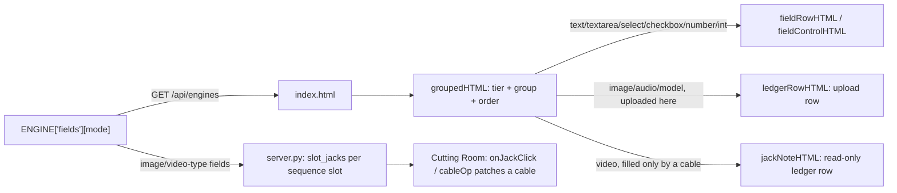

# Writing an engine pack

An engine pack teaches the app a model family. The core (`server.py`) never names a model
or an engine — everything model-specific lives in one file under `engines/`. This is the
pack contract, read straight from the loader (`engines/__init__.py`, which every claim
below cites by function).

## The minimum: a module-level `ENGINE` dict

Any `.py` file dropped into `engines/` that exposes a module-level dict named `ENGINE`
with a truthy `id` is picked up automatically (`engines._discover()`, which scans the
package directory once with `pkgutil.iter_modules` and imports every module that isn't
prefixed `_`). Nothing needs registering by hand.

```python
# engines/my_engine.py
def my_mode_graph(args, models):
    return {
        "1": {"class_type": "CheckpointLoaderSimple",
              "inputs": {"ckpt_name": models["my_ckpt"]}},
        "2": {"class_type": "CLIPTextEncode",
              "inputs": {"text": args.get("prompt", ""), "clip": ["1", 1]}},
        "3": {"class_type": "CLIPTextEncode",
              "inputs": {"text": args.get("negative", ""), "clip": ["1", 1]}},
        "4": {"class_type": "EmptyLatentImage",
              "inputs": {"width": 1024, "height": 1024, "batch_size": 1}},
        "5": {"class_type": "KSampler",
              "inputs": {"model": ["1", 0], "positive": ["2", 0], "negative": ["3", 0],
                         "latent_image": ["4", 0], "seed": args.get("seed", 0),
                         "steps": 20, "cfg": 7.0, "sampler_name": "euler",
                         "scheduler": "normal", "denoise": 1.0}},
        "6": {"class_type": "VAEDecode", "inputs": {"samples": ["5", 0], "vae": ["1", 2]}},
        "7": {"class_type": "SaveImage",
              "inputs": {"images": ["6", 0], "filename_prefix": "my-engine/IMG"}},
    }


ENGINE = {
    "id": "my-engine",
    "cap": "image",
    "roles": {
        "my_ckpt": ("checkpoint", {"all": ["my-model"]}),
    },
    "provides": {
        "my-mode": ["my_ckpt"],
    },
    "words": {
        "my_ckpt": "the My-Model checkpoint",
    },
    "graphs": {
        "my-mode": my_mode_graph,
    },
    "describe": lambda models: "My Model",
}
```

The graph function is defined **before** `ENGINE` on purpose: `engines._discover()` imports
the module top to bottom, and `ENGINE["graphs"]` needs `my_mode_graph` to already exist as a
name — defining it after `ENGINE` raises `NameError` at import time, and the pack never
loads. The graph itself is complete and ends in a `SaveImage` node: a graph with no
recognized output node finishes on the lane but is marked as an error here (no output to
show). This sample was proven by writing it to `engines/` in a scratch copy of the repo,
importing it through `engines._discover()`, and calling `my_mode_graph({}, {"my_ckpt":
"placeholder.safetensors"})` — it imports cleanly and returns the seven-node dict above.

That alone is a working pack: it appears in a room built from its own label, and a lane
with the right file on disk can run it.

A ComfyUI pack normally declares `roles` (what discovery looks for on a lane); a **process**
pack instead declares `"lane_kind": "process"` and `"bins"` (the local executables it needs)
— see `engines/turntable.py`, and "**`lane_kind`**" below. A process pack has no `roles` key
at all.

## The required keys

- **`id`** (`str`) — unique pack id, e.g. `"qwen-image"`.
- **`cap`** (`str`) — the lane capability this pack needs, e.g. `"image"`, `"video"`,
  `"audio"`, `"3d"`. A lane offers a pack's modes only if the lane declares this cap.
- **`roles`** (`dict[str, (pool_name, rule_dict)]`) — required for a ComfyUI pack (the
  default `lane_kind`); a **process** pack (`"lane_kind": "process"`) has no `roles` at
  all and declares `"bins"` instead (see `lane_kind` below). What server-side discovery
  looks for on a lane: which model *pool* to scan (`checkpoint`, `unet`, `clip`, `vae`,
  `lora`, ...) and a rule (`all` / `none` / `any` name fragments to filter, `prefer` to
  rank) that picks one file out of that pool. `engines.role_pool()`/`role_rules()` merge
  every pack's roles into the one table discovery scans against.
- **`provides`** (`dict[str, list]`) — ability name -> list of roles. A **process** pack
  still declares this (e.g. `engines/turntable.py`'s `{"turntable": ["blender", "ffmpeg"]}`)
  even though it has no `roles` dict of its own to satisfy those entries against — its
  role names instead name binary keys from its own `"bins"` dict, and `engines.abilities()`
  resolves them the same way regardless of pack kind. An ability is true only when *every*
  listed role resolved (to a real model file for a ComfyUI pack, or a resolvable binary
  for a process pack). A role entry can itself be a list, meaning "any one of these is
  enough" (e.g. an int8 or an nvfp4 text encoder — either satisfies the role).
- **`words`** (`dict[str, str]`) — role -> plain-English label, used in "X is missing"
  messages (`engines.missing_words()`).
- **`graphs`** (`dict[str, callable(args, models) -> dict]`) — mode name -> a function
  that builds one ComfyUI graph dict. `engines.graph_for(cap, mode, args, models)` calls
  the first pack that declares this `(cap, mode)`.
- **`describe`** (`callable(models) -> str`) — a short label for what's installed, e.g.
  `"Qwen-Image 2.1 (GGUF)"`. A pack whose `describe()` raises falls back to its `id`.

## Optional keys, and what each one is for

- **`licence`** — one dict, or a list of dicts (one per licence regime a pack ships
  under), each with `name`, `shippable` (bool) and `attribution`. A list entry may name
  which `modes` it covers; without that key it covers the whole pack. Read at every
  finished job by `engines.licence_for(cap, mode)`.
- **`cap_word`** — a bare noun for the cap in a sentence ("sound" for `"audio"`, "picture"
  for `"image"`), no article — callers plug it into "the ___ models". Falls back to the
  cap name.
- **`cap_order`** — display order for a cap's tab/button; lower sorts first. Undeclared
  caps sort after every declared one (`engines.cap_order()`).
- **`mode_words`** — mode -> a short human label shown instead of the bare mode name.
- **`mode_rooms`** — mode -> a room id from `rooms.json`. A mode naming no room, or one
  `rooms.json` doesn't list, still shows up: `engines.rooms()` builds a room for it from
  the mode's own label.
- **`mode_notes`** — mode -> one plain sentence saying *when* to pick this mode over its
  room-mates. Must be drawn from evidence already in the pack (a preset's own note, a
  `quality` tier's `why`) — never an invented claim.
- **`prompt_guides`** — mode -> an instruction telling a prompt-writing helper how a
  prompt for *this* mode must be written (e.g. "positive prompt only", a tag style for
  songs). Same evidence discipline as `mode_notes`.
- **`writers`** — mode -> a writing skill for the room's guide: a topic in, this mode's
  field values out (`POST /api/guide/skill`, the "Write it for me" button). Each is a dict:
  `label` (e.g. "Song writer"), `prompt` (the writer's system prompt, this engine's own
  rules), `keys` (`{"TAGS": "tags", ...}`: output line key -> field id), `multiline` (the one
  key, also in `keys`, whose value runs to the end of the reply, e.g. `"LYRICS"`),
  `none_token` (e.g. `"NONE"`: on the multiline key it means an empty field, on any other
  key "leave the field as it is"), optional `options` (`{field id: [allowed values]}` for a
  text field the engine takes only from a fixed list) and `check(values, request)` -> a list
  of plain problem sentences. The reply is line-delimited, one `KEY: value` per line, never
  JSON: small models do not reliably escape newlines inside a JSON string. It may instead be
  a single `QUESTION: ...` line, the writer asking one thing before it writes. The core
  coerces every value against the mode's own fields (a value out of range is left out and
  named, never clamped), runs `check`, and on problems retries once; problems still left are
  shown to the user with the fields. `check` also runs at Make time: a request it finds
  problems in is refused with `needs_confirm` until the user presses "Make anyway". See
  `engines/audio.py`'s song writer (`SONG_WRITER_PROMPT`, `song_check`).
- **`fields`** — mode -> list of field descriptors, each with `id`, `label`, `type`
  (`text`/`textarea`/`number`/`int`/`select`/`checkbox`/`audio`/`image`/`image_list`/
  `video`/`video_list`/`model`) and optionally `default`, `hint`, `options` (for `select`). This is how a
  pack describes its own form; the core renders whatever it's told rather than knowing
  any field by name. Use `"int"` whenever the graph builder's own kwarg is typed `int`
  (e.g. a BPM) — a `"number"` default silently drifts a float into an integer field.

  A field may also carry curation:
  - `tier` — `"primary"` or `"advanced"`. Primary fields are the handful touched every
    time; more than about five means it wasn't curated.
  - `group` / `order` — an authored group name and this field's position inside it.
    Never rely on dict order.
  - `units` — e.g. `"BPM"`, `"seconds"`, `"px"`. Required on every `number`/`int` field.
  - `range` — `[hard_min, hard_max]`, a valid clamp.
  - `ui_range` — `[lo, hi]`, what a slider should *cover* (the comfortable span,
    different from `range` on purpose — BPM might be valid 40-220 but comfortable
    70-160). Must lie inside `range`.
  - `enabled_when` / `disabled_reason` — a small declaration the core evaluates
    (`{"field": "plan", "equals": True}`, supporting `equals`/`not_equals`/`truthy`) —
    never a string it evaluates as code — plus a plain sentence explaining why the field
    is off when the condition fails.
  - `max` — on an `"image_list"` field, the real limit the graph honours. The core
    refuses rather than silently truncating a caller who passes more than this.
- **`presets`** — mode -> list of `{"id", "label", "note", "values"}`. A named parameter
  set; `values` is a partial field map. `note` cites where the setting was measured — a
  preset encodes a measurement, not a guess. May also carry `"ref_role": "set"` or
  `"character"`, compared only against a reference's own recorded role, never a preset
  name.
- **`quality`** — mode -> list of tier dicts: `id`, `label`, `why` (one plain sentence,
  never a step count or model name), `values` (a partial field map), `default` (bool,
  exactly one `True` per mode), and optionally `requires` (an ability name from this
  pack's `provides`) with `unavailable_reason`.
- **`examples`** — mode -> list of `{"id", "label", "recipe", "quality", "values", "why",
  "needs"}` — the one-click "Try this" row. `recipe`/`quality` reference this mode's own
  `presets`/`quality` ids (or `None`); `needs` is `None` or a `cap_word` naming an input
  the user must still supply.
- **`mode_deps`** — mode -> `callable() -> str | None`. A check the pack runs for
  itself, independent of any lane's model files — e.g. a local Python package a `post`
  step needs. Returns a plain sentence naming the fix, or `None` when it can run. Folded
  into the same "missing" the UI already shows for an absent model file.
- **`post`** — mode -> `callable(input_bytes, filename, args) -> (output_bytes,
  output_filename)`. A step that runs inside the server process after a lane finishes
  rendering this mode (no ComfyUI node, no second model call), applied to the lane's
  primary output and kept as an *additional* output; the lane's own render is never
  discarded. It may use optional Python dependencies beyond the stdlib — Pixel Art's
  deterministic colour-lock/dither pass (`engines/pixelart.py`, `engines/_quantise.py`)
  needs both **NumPy and Pillow** — but declare every such dependency via `mode_deps` (see
  below) so a lane without them gets a plain "install this" sentence instead of a crash.
- **`lane_kind`** — `"comfy"` (the default) or `"process"`. A process pack runs a local
  program instead of a ComfyUI graph — see `engines/turntable.py`, which sets
  `"lane_kind": "process"` and `"bins": {"blender": "blender", "ffmpeg": "ffmpeg"}` (the
  executable names, read by `runner.py`; never hardcoded in the core).
- **`legacy_dispatch`** — `True` only for packs the core's own hand-tuned dispatch logic
  still owns (cfg defaults, frame-grid snapping). New packs should not set this; it exists
  for two packs mid-migration to the generic field-driven path (`engines.legacy_dispatch()`).

## From a field list to the page

<!-- Every named step matches a real function: fieldRowHTML/fieldControlHTML
     render a plain field (index.html); ledgerRowHTML renders an
     image/audio/model upload field, jackNoteHTML a read-only "video" field
     (index.html, both cited above §4/§7's jacks); slot_jacks() (server.py)
     turns a slot's own image/video fields into the Cutting Room's jacks,
     patched by onJackClick()/cableOp() into a cable (index.html). -->


## A worked example: audio

`engines/audio.py`'s `ENGINE` dict is a full worked example with five modes (song, music,
sfx, yue2, cover) sharing one pack, each with its own roles, fields, presets and prompt
guide — read it alongside this doc. `engines/ltx.py` is a good second read for a
`"legacy_dispatch"` video pack, and `engines/turntable.py` for a `"process"` lane pack.

## What the loader exposes to the core

`packs()`, `role_pool()`, `role_rules()`, `model_keys()`, `abilities()`, `missing_words()`,
`mode_ability()`, `describe()`, `graph_for()`, `modes_for()`, `licences()`, `licence_for()`,
`caps()`, `cap_word()`, `cap_order()`, `mode_words()`, `mode_room()`, `mode_note()`,
`prompt_guide()`, `rooms()`, `fields()`, `presets()`, `quality()`, `examples()`,
`mode_deps_reason()`, `post_for()`, `lane_kind()`, `bins()`, `pack_dir()`, `primary_role()`,
`legacy_dispatch()`, `has_legacy()` — this is the whole surface `server.py` calls through
`engines.*` to stay model-agnostic (`unet_loader()`/`quant_words()` are helpers a *pack*
imports and calls directly, e.g. `engines/qwen_image.py`'s
`from . import unet_loader, quant_words` — `server.py` never calls either).

**Precedence is NOT one rule ("first pack wins") across every lookup — it differs per
function, and reading the wrong one wrong is a real bug source:**

- `role_pool()`/`role_rules()` (`engines/__init__.py`): a flat dict built by iterating every
  pack in id order and assigning `out[role] = ...` with no "already set" guard — the LAST
  pack (alphabetically by id) to declare a given role name silently overwrites an earlier
  one's rule for that same role name. Two packs must never declare the same role name with
  different meanings.
- `abilities()`: merges every pack's `provides` (every ability from every pack ends up in
  the result), then ORs each cap's truth across every pack that shares it (`cap_from`) — not
  a "first wins" pick at all.
- `cap_word()`/`cap_order()`/`describe()`: the first pack (in id order) that actually
  *declares* a non-empty value wins; a pack that deliberately returns `""` (`engines/cleanup.py`,
  `engines/pixelart.py`) is a tool riding on another pack's cap and is skipped on purpose, so
  the cap's headline is never accidentally claimed by a tool pack that happens to sort first.

Read the function itself before assuming either rule for one not listed above.
